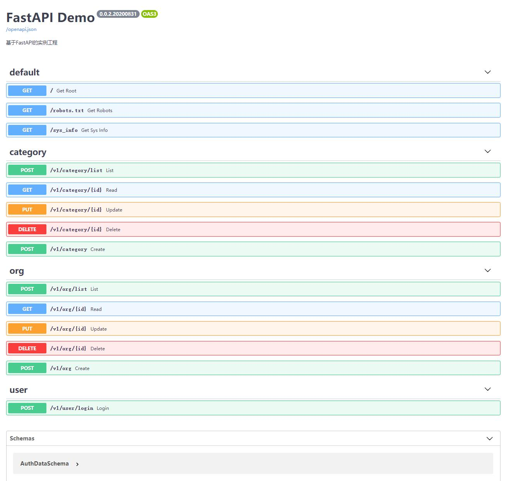

# FastAPI Demo
这是一个Python FastAPI实例工程。

[Github: FastAPI Demo](https://github.com/zhenqiang-sun/fastapi_demo/)

https://github.com/zhenqiang-sun/fastapi_demo/
https://gitee.com/erlitech/fastapi_demo/

## 环境组件

### 版本：
Python 3.8

### 组件：
- FastAPI Plus: https://github.com/zhenqiang-sun/fastapi_plus/  https://gitee.com/erlitech/fastapi_plus/
- FastAPI: https://fastapi.tiangolo.com/
- uvicorn: https://www.uvicorn.org/
- SQLAlchemy: https://www.sqlalchemy.org/
- PyMySQL: https://pymysql.readthedocs.io/
- REDIS: https://github.com/andymccurdy/redis-py


## 项目结构

```
├─app    # 项目代码目录
│  ├─config      # 配置文件目录
│  │  ├─anonymous.py  # 可匿名访问接口配置文件
│  │  ├─db.py         # 数据库连接配置文件，关系数据库，如mysql
│  │  ├─fastapi.py    # FastAPI项目配置文件
│  │  ├─mongo.py      # mongo数据库连接配置文件
│  │  └─redis.py      # redis连接配置文件
│  ├─controller  # 控制器层，API入口
│  ├─dao         # DAO层，数据访问对象
│  ├─model       # Model层，数据表对象
│  ├─schema      # Schema层，数据结构验证层，对API出入参数的校验、过滤、转换
│  ├─service     # Service层，业务逻辑处理层
│  ├─sql         # 原生SQL文件目录，复杂的SQL语句单独存放这里
│  ├─templates   # 模板目录，如html、excel、email等模板文件
│  ├─temporary   # 临时文件目录，运行过程中生成的临时文件存放
│  └─utils       # 工具箱
├─docker  # 项目docker运行脚步目录
│  ├─deploy.sh   # shell部署脚本
│  ├─deocker-compose.yml  # deocker-compose部署脚本
│  └─run.sh      # docker内运行项目脚本，采用uvicorn
├─res     # 项目静态资源目录，如附件、图片、视频等文件
├─venv    # python 虚拟环境目录
├─dev_run.py          # 开发模式运行项目
└─dev_db_2_model.py   # 根据已有数据库表生成 ORM 使用的 model.py
└─dev_model_2_db.py   # 根据已有 ORM 使用的 model.py 生成数据库表
```


## 开发运行

```bash
# 初始化venv：
virtualenv venv

# 如提示找不到virtualenv，则先执行：
sudo pip install -i https://mirrors.aliyun.com/pypi/simple/ virtualenv

# 进入venv for Linux、Mac：
source venv/bin/activate

# 进入venv for Windows
venv\Scripts\activate.bat

# 安装依赖环境：
pip install -i https://mirrors.aliyun.com/pypi/simple/ -r requirements.txt

# 开发运行
python dev_run.py

# 根据已有数据库表生成 ORM 使用的 model.py
python dev_db_2_model.py

# 根据已有 ORM 使用的 model.py 生成数据库表
python dev_model_2_db.py
```


## 接口风格
采用RESTful风格，但有几点特殊

### 接口风格特殊点

- 1、使用版本，且放置在前，如`/v1/**`。
- 2、使用POST方法获取列表，因为要传递过滤和搜索参数，所以POST更方便。
- 3、使用名字单数，一方面因为上一条，另一方面除了列表其实一直是对单条数据进行操作，所以使用单数。
- 4、基于上两条，所以获取列表的接口通常是名词后加list，如：/v1/category/list。

### 接口风格举例

|  请求方法  |  路径  |  说明  |
|  ----  |  ----  |  ----  |
| `POST`    | /v1/category      | 创建一个类别 |
| `DELETE`  | /v1/category/{id} | 删除一个类别 |
| `PUT`     | /v1/category/{id} | 修改一个类别 |
| `GET`     | /v1/category/{id} | 获取一个类别 |
| `POST`    | /v1/category/list | 获取类别列表 |


## 接口实例

